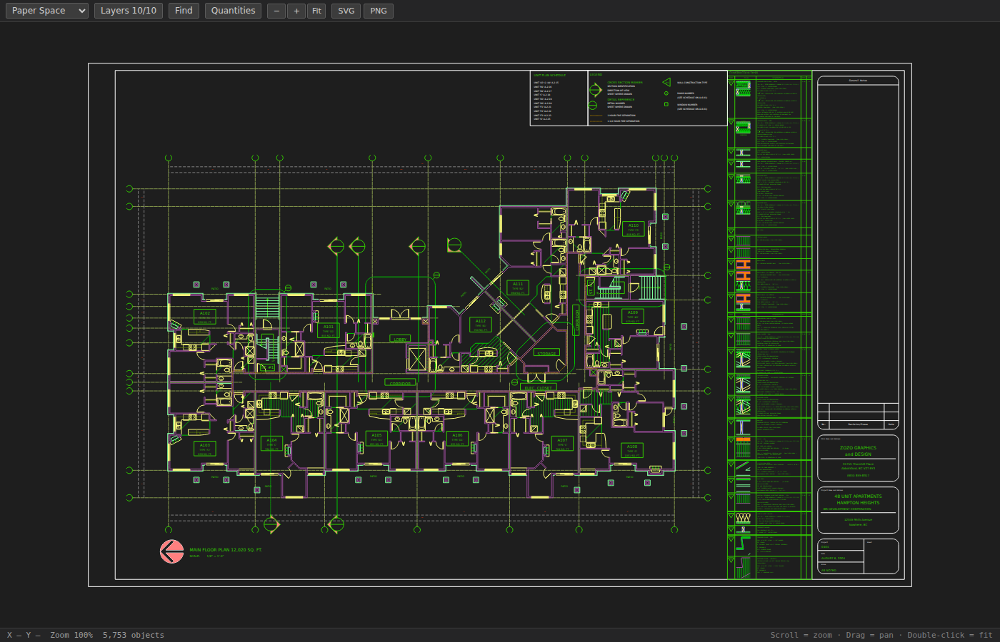
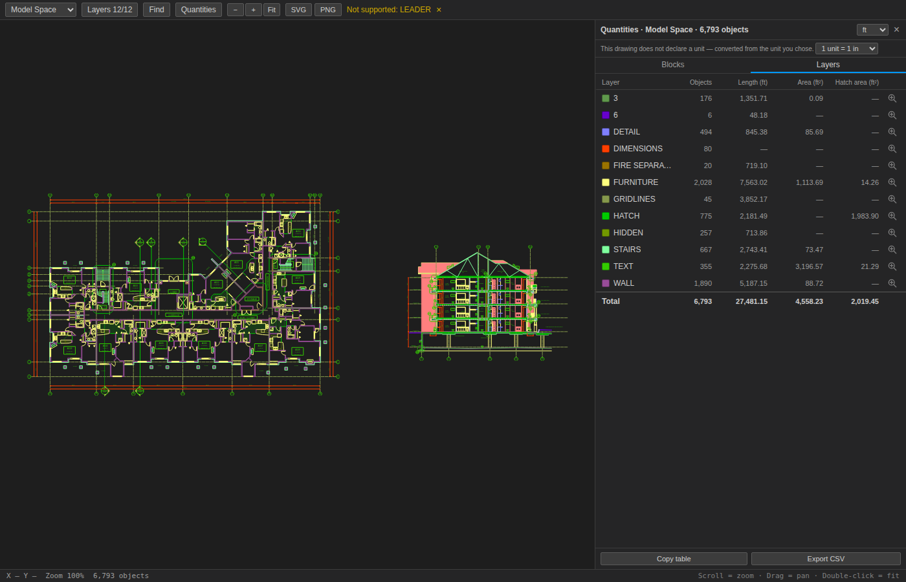
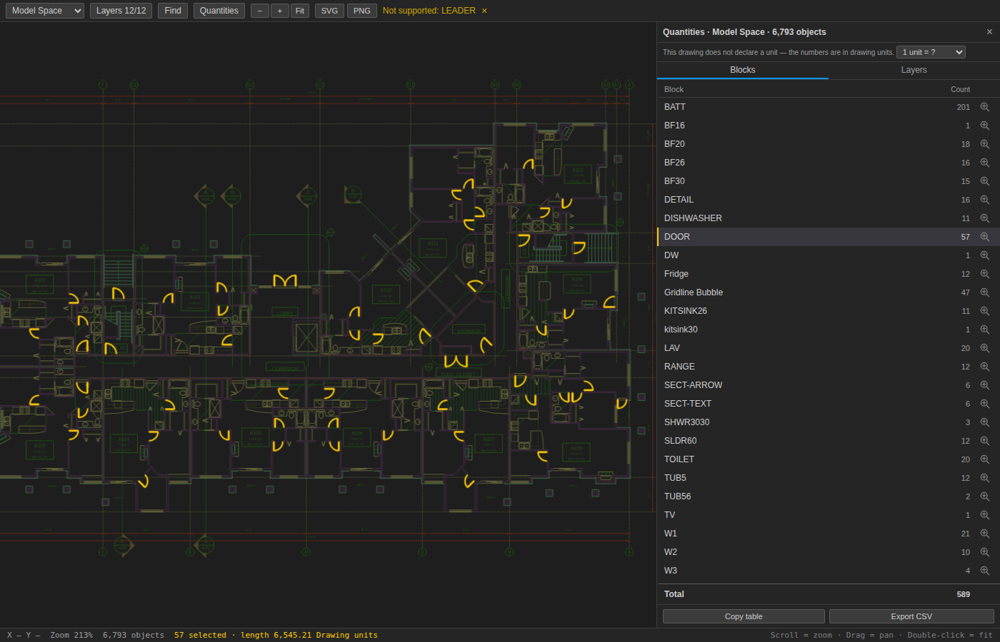
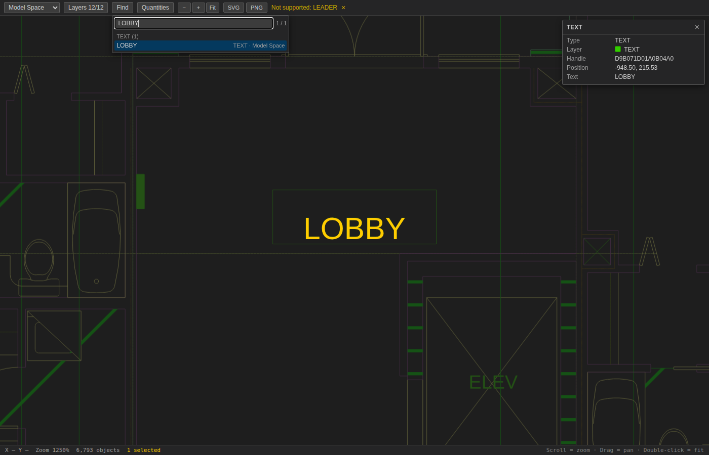

# AutoCAD DWG & DXF Previewer for VS Code

**Open any `.dwg` or `.dxf` drawing straight in VS Code. No AutoCAD. No license. No conversion step.**

Someone sends you a DWG file. You don't have AutoCAD — or you do, but launching it just to
glance at a floor plan is absurd. Install this extension, double-click the file, and the
drawing opens in your editor: pan it, zoom it, turn layers on and off, flip between sheets,
export it as an image.

Works fully offline on Windows, macOS and Linux. Your drawings never leave your machine.

---

## Why people install it

**You received a DWG or DXF and can't open it.** No AutoCAD license, no trial signup, no
sketchy "free online DWG viewer" that wants you to upload a client's floor plan to a random
server.

**Your repository contains CAD files.** Site plans, panel layouts, machine drawings — review
them during a pull request without leaving the editor or asking someone to export a PDF.

**You just need to check one thing.** A dimension, a room label, which layer something sits
on. Ten seconds instead of a five-minute application launch.

**You're a developer working with CAD data.** Inspect the drawings your code parses, right
next to the code that parses them.

---

## What you get

- **Instant preview** — double-click a `.dwg` or `.dxf` file, that's the whole workflow
- **DXF opens with no conversion at all** — DXF is the format this extension reads natively,
  so those files skip straight to rendering
- **Pan and zoom** — scroll to zoom toward the cursor, drag to pan, double-click to fit
- **Layer control** — show or hide any layer, with an entity count for each
- **Find (Ctrl+F)** — search text, attributes (part numbers, door tags — hidden ones too), block
  names, layers and object types across every sheet; jump from hit to hit with Enter
- **Click to inspect** — click any line of a block to select the whole block and see its layer,
  position, rotation, scale and attributes
- **Quantities** — count every block (`Door-900` × 14) and measure linework and area per layer,
  in the units the drawing declares (or the one you pick, when it declares none); shift-click a
  few objects to add up their length and area, and copy the table straight into a spreadsheet
- **Compare drawings** — *Compare with HEAD* (Git), *Compare with File…* or two selected files:
  added objects in green, removed in red, changed in yellow over their old shape, with a list of
  every change to step through (F7)
- **Multi-sheet drawings** — switch between Model Space and every Paper Space layout
- **Export to SVG or PNG** — drop a drawing into a document, ticket, or chat
- **Live reload** — the view refreshes when the file changes on disk, keeping your sheet, layers and zoom
- **Dark canvas** — drawings are shown on a dark background, as in AutoCAD
- **Fast on big drawings** — a 45,000-entity site plan opens in about two seconds, and
  reopening it is instant

---

## Quick start

1. Install the extension
2. Open a `.dwg` or `.dxf` file
3. There is no step 3

Nothing to configure. No converter to install. No account.

---

## FAQ

**Do I need AutoCAD installed?**
No. The DWG reader is built into the extension.

**Which AutoCAD versions are supported?**
R14 through 2020 and later (AC1014 – AC1032).

**Can I edit drawings?**
No — this is a viewer. Your files are opened read-only and are never modified.

**Are my files uploaded anywhere?**
Never. Everything runs locally inside VS Code, and it works with no internet connection.

**Does it work with DXF files?**
Yes. `.dxf` files open directly and skip the conversion step entirely, so they load faster
than DWG. ASCII DXF is supported; binary DXF is not, and says so clearly instead of opening
blank.

**What if a file has the wrong extension?**
The format is detected from the file's own header, not its name, so a DWG saved as `.dxf`
still opens correctly.

**Is 3D supported?**
This is a 2D viewer. 3D drawings open, but solids are not rendered; 3DFACE geometry appears
as wireframe.

**A drawing looks incomplete — why?**
The toolbar shows a banner naming entity types it read but couldn't draw. Some types
(LEADER, MULTILEADER, TABLE, WIPEOUT, 3D solids) are dropped before that point and are not
listed yet, so a drawing can be missing those without a banner. Objects hidden in the file
itself — invisible attributes, hidden dynamic-block states — are left out on purpose, as in
AutoCAD. Please report drawings that look wrong.

---

## What it can draw

| | |
|---|---|
| **Geometry** | LINE · CIRCLE · ARC · POLYLINE · LWPOLYLINE · SPLINE · ELLIPSE |
| **Fills** | SOLID · HATCH |
| **Text** | TEXT · MTEXT · ATTRIB — with fonts, alignment and rotation |
| **Blocks** | INSERT — nested, rotated, mirrored, scaled, and grid arrays (mirrored arcs, circles, polylines, text and hatches too) |
| **Dimensions** | DIMENSION — measurement label and line |
| **Other** | POINT · 3DFACE · viewports on paper-space sheets |

Layers keep their colors and linetypes from the original drawing; line weights set directly
on an object are kept too. Layers switched off in a DXF start hidden.

---

## Settings

None required. One optional setting, `dwgPreviewer.converterPath`, lets you point at an
external converter for unusual files — almost nobody needs it.

---

## Found a problem?

Open **View → Output** and select **DWG Previewer** to see exactly what happened during
conversion, then open an issue on the repository with that log and, if you can share it,
the drawing.

---

## Support the project

The extension is free and stays free. If it saved you an AutoCAD launch or a license, you can
[buy me a coffee ☕](https://buymeacoffee.com/bumkom) — it keeps the updates coming.

---

*Not affiliated with, endorsed by, or sponsored by Autodesk. AutoCAD, DWG and DXF are
trademarks of Autodesk, Inc., used here only to describe the file formats this extension
reads.*

---

## License

Open source under **GPL-3.0-or-later**. DWG reading is powered by
[GNU LibreDWG](https://www.gnu.org/software/libredwg/) (via `@mlightcad/libredwg-web`, GPL-3.0).
